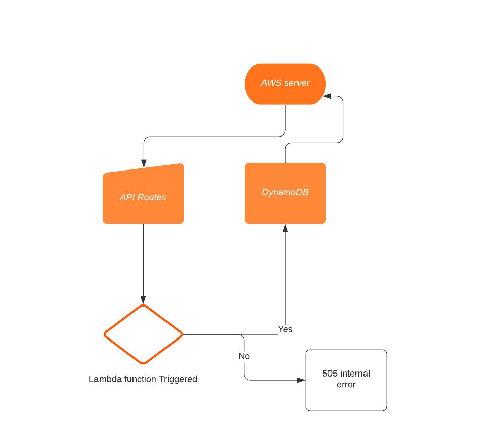

## serverless API
Work in a non-main branch in a new repository called ‘serverless-api’. While your code will all reside in a single repo, your functions will need to be individually .zipped and deployed using common libraries (node_modules) and schema files.

Create one table for one data model at Dynamo DB
Create a Dynamoose schema to define the structure of your table
Write lambda functions that will separately perform the proper CRUD operation on the database
Create your routes using API Gateway
Routes should integrate with the appropriate Lambda function to perform the operations

/get = gets all items in DB
/post - creates new table inside DB with the OBJ schema properties
/delete/{id} = deletes one object per ID
/put/{id} = updates one object per ID

AWS API:
still waiting for login

PULL REQ:
https://github.com/yazanbaker94/serverless/pull/1

## UML Diagram:

